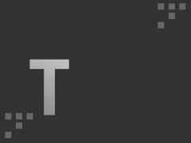

# Tech Challenge 2 - FIAP

---

## Grupo

- Guilherme Buzati, RM354942
- Helielton Fioramonte, RM355309
- Luiz Fernando, RM356132

## Funcionalidades

- [x] Criação de Autores
- [x] Autenticação
- [x] Listagem de Posts, com filtros por texto (tanto titulo quanto conteúdo)
- [x] Busca por Post
- [x] Criação de Post
- [x] Exclusão de Post
- [x] Atualização de Post

## Principais ferramentas, bibliotecas e frameworks

- [Express](https://expressjs.com/), framework minimalista para nodejs
- [Valibot](https://valibot.dev/), alternativa ao Zod para validação de schemas
- [Vitest](https://vitest.dev/) como framework para testes
- [Pg](https://github.com/brianc/node-postgres) como driver postgres
- [Kysely](https://kysely.dev/) sql query builder que integra com o driver pg
- [Testcontainers](https://testcontainers.com/) Framework utilizado para subir instancias de testes do postgres,
  utilizadas nos testes de integração
- [Tsup](https://tsup.egoist.dev/), bundler typescript para produção
- [Tsx](https://github.com/privatenumber/tsx) executar Typescript, utilizado
  no desenvolvimento